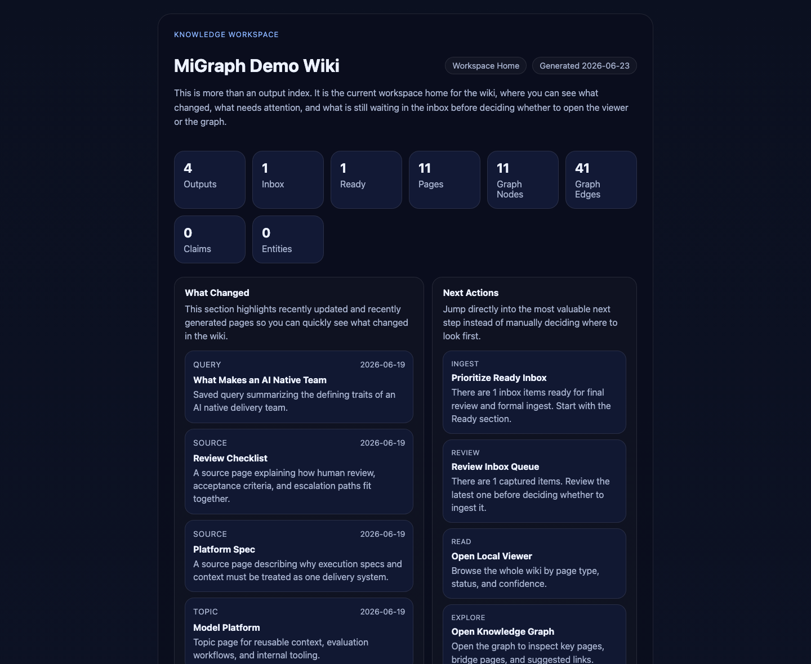
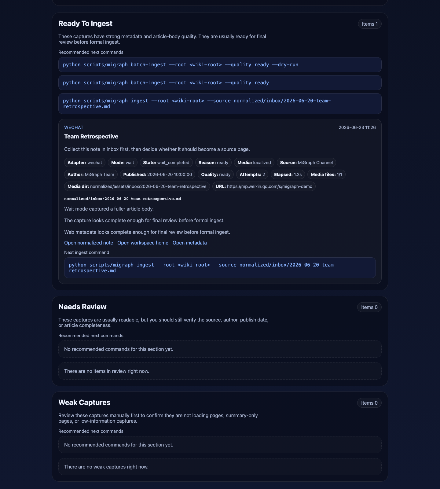
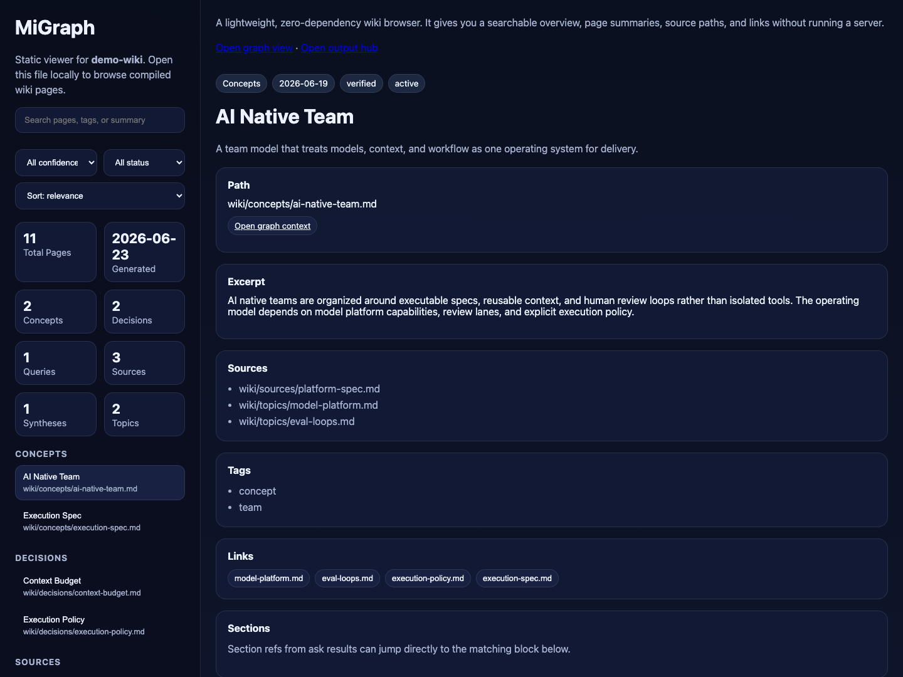
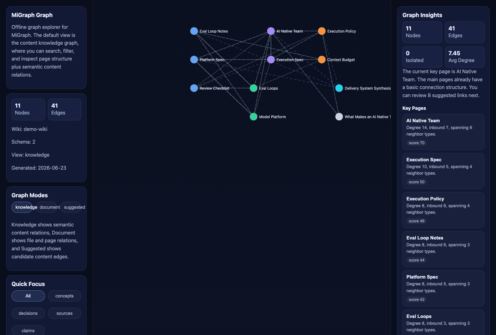
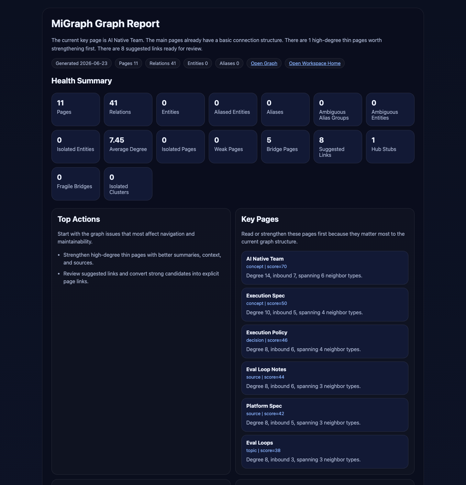

<p align="center">
  
</p>

<h1 align="center">MiGraph</h1>

<p align="center">
  <strong>Your local knowledge base, powered by conversation.</strong>
</p>

<p align="center">
  
  
  
</p>

<p align="center">
  <a href="#overview">Overview</a> •
  <a href="#features">Features</a> •
  <a href="#how-it-works">How It Works</a> •
  <a href="#architecture">Architecture</a> •
  <a href="#installation--usage">Installation & Usage</a> •
  <a href="#configuration">Configuration</a> •
  <a href="#commands">Commands</a> •
  <a href="#html-output">HTML Output</a> •
  <a href="#tests">Tests</a> •
  <a href="#documentation">Documentation</a> •
  <a href="#license">License</a>
</p>

---

## Overview

Transform loose documents, webpages, notes, and conversations into a durable Markdown workspace. Talk to your agent to create, organize, and research knowledge — with inbox review, local browsing, and an interactive knowledge graph you open in the browser.

[](docs/assets/output-hub-preview.png)

### What's Inside

| Feature | Description |
|---------|-------------|
| **Markdown Workspace** | Structured pages with YAML frontmatter — `source`, `topic`, `concept`, `decision`, `synthesis`, `query`, `entity` |
| **Web Capture** | `clip` captures webpages with metadata, WeChat adapter, and `wait` mode for dynamically rendered pages |
| **Review Inbox** | Captures sit in a queue before becoming pages — review quality, metadata, and article body |
| **Knowledge Graph** | Interactive graph with 3 views: `knowledge`, `document`, `suggested` — includes claims, semantic relations, and entity governance |
| **Entity Merging** | Detects ambiguous aliases and lets you merge entities deterministically |
| **Q&A** | Ask questions against existing wiki — answers with real evidence and sources |
| **Local Heuristics** | Works without AI — content generation and embeddings are optional |
| **HTML Output** | Inbox, viewer, graph, and report are static HTML pages you open in the browser |

---

## Features

### 🗂️ Markdown Workspace

- **YAML frontmatter**: title, type, summary, sources, entities, confidence, status
- **7 page types**: `source`, `topic`, `concept`, `decision`, `synthesis`, `query`, `entity`
- **Derived types**: `pattern`, `runbook`, `architecture` live in `wiki/patterns/`, `wiki/runbooks/`, `wiki/architectures/`
- **Auto-detected root**: `.wiki-schema.md` identifies an existing workspace

### 🌐 Web Capture (`clip`)

- **Generic + WeChat adapter**: automatic article type detection
- **`wait` mode**: waits for dynamic rendering before extracting content
- **Media capture**: `always`, `ask`, or `never` — localize images during capture or keep them remote
- **Structured capture reasons**: `loading_placeholder`, `body_too_short`, `metadata_sparse` — the inbox explains why an item needs attention
- **SSRF protected**: scheme allowlist, private/metadata IP blocking, redirect validation

### 📥 Review Inbox

- **3 groups**: `ready`, `to review`, `weak`
- **Browser review**: `output/inbox/index.html` shows adapter, author, date, quality
- **Recommended commands**: each item shows the next `ingest` or `batch-ingest` to run

### 🌐 Knowledge Graph (schema v2)

- **Views**: `knowledge` (default), `document`, `suggested`
- **Page-backed nodes**: `source`, `topic`, `concept`, `decision`, `synthesis`, `query`, `entity`
- **Extracted claims**: `claim` nodes connected via `asserts`, `supports`, `contradicts`
- **Semantic relations**: `about`, `belongs_to`, `depends_on`, `suggests_related_to`
- **Graph insights**: key pages, bridges, isolated pages, suggested links

### 🔍 Entity Governance

- **Alias detection**: string comparison + optional semantic embedding
- **Merge review**: `entity-merge-review` generates an interactive HTML report
- **Deterministic apply**: `entity-merge-apply` merges pages and rebuilds outputs

### 💬 Q&A

- **ask**: question against existing wiki — answers with real evidence
- **correct**: save corrections and lessons learned
- **query**: persist valuable answers as `query` pages

### 🤖 AI (disabled by default)

- **Content generation** (`crystallize`, `digest`): any OpenAI-compatible chat completions endpoint
- **Embeddings** (`entity-merge-review`, `graph-report`, `health`): local Ollama default
- **Local heuristics**: works without any AI configuration

---

## How It Works

```
┌─────────────────────────────────────────────────────┐
│                  MiGraph Core                        │
├──────────────┬──────────────┬───────────────────────┤
│    Wiki      │  Inbox       │   HTML Output           │
│  (Markdown)  │  (captures)  │   (viewer, graph,     │
│              │              │    inbox, report)      │
├──────────────┴──────────────┴───────────────────────┤
│            scripts/migraph (unified CLI)           │
│   init · clip · ingest · ask · graph · serve      │
├─────────────────────────────────────────────────────┤
│  AI (optional, disabled by default)               │
│     MIGRAPH_LLM_* · MIGRAPH_EMBED_*               │
└─────────────────────────────────────────────────────┘
```

### Import Workflow

1. **Resolve root** — detects `.wiki-schema.md` or uses `--root`
2. **Convert / capture** — `convert` for local files, `clip` for web
3. **Review inbox** — `inbox` generates an HTML review page
4. **Ingest** — `ingest` promotes reviewed captures to wiki pages
5. **Refresh outputs** — `graph`, `viewer` rebuilds HTML

### Web Capture Flow

```
clip --url <URL>
  → HTTP GET + parse (BeautifulSoup + markdownify)
  → Generic or WeChat adapter
  → Extracts: title, author, date, site, body
  → Writes: raw/inbox/ + normalized/inbox/ + output/inbox/index.html
  → Returns: next ingest command to run
```

---

## Architecture

### Core Components

| Component | File | Function |
|-----------|------|----------|
| **CLI Entry** | `scripts/migraph` | Single entry point — dispatches to scripts |
| **Runtime** | `scripts/bootstrap_runtime.py` | Creates `.venv`, installs dependencies |
| **Wiki Init** | `scripts/init_wiki.py` | Initializes workspace with directory structure |
| **Conversion** | `scripts/convert_source.py` | Converts PDF, DOCX, XLSX, PPTX → Markdown |
| **Web Capture** | `scripts/clip.py` | Captures URLs with WeChat adapter + wait mode |
| **Ingestion** | `scripts/ingest.py` | Creates wiki pages with structured frontmatter |
| **Inbox** | `scripts/build_inbox.py` | Generates `output/inbox/index.html` review page |
| **Q&A** | `scripts/ask.py` | Answers against existing wiki |
| **Viewer** | `scripts/build_viewer.py` | Generates `output/viewer/index.html` |
| **Graph** | `scripts/build_graph.py` | Generates interactive graph with 3 views |
| **Report** | `scripts/graph_report.py` | Graph governance report in HTML |
| **Entity Review** | `scripts/entity_merge_review.py` | Detects ambiguous aliases |
| **Entity Merge** | `scripts/entity_merge_apply.py` | Merges entities deterministically |
| **Server** | `scripts/serve_outputs.py` | Loopback HTTP for browsing outputs |
| **Health** | `scripts/health.py` | Checks workspace integrity |
| **Status** | `scripts/status.py` | Compact workspace summary |
| **AI Clients** | `scripts/llm_client.py`, `scripts/embed_client.py` | LLM + embeddings, OpenAI-compatible |
| **AI Config** | `scripts/ai_config.py` | Resolves `MIGRAPH_*` environment variables |

### Repository Structure

```
MiGraph/
├── scripts/                  # Unified CLI + all command scripts
├── skills/
│   ├── knowledge-create/     # Create validated knowledge notes (templates, validators, hooks)
│   └── knowledge-manager/    # Full knowledge lifecycle (create, dedupe, organize)
├── templates/
│   ├── pages/                # Page templates (concept, pattern, runbook, ...)
│   └── root/                 # Workspace scaffolding (index, log, AGENTS)
├── examples/
│   └── knowledge/            # Example knowledge base (IaC, DevOps, AI, patterns)
├── tests/                    # Test suite
├── docs/                     # Documentation and previews
├── SKILL.md                  # Installed as the "migraph" skill
└── pyproject.toml            # Ruff + mypy configuration
```

### Workspace Structure

```
<wiki-root>/
├── .wiki-schema.md          # Workspace marker
├── index.md                 # Main page
├── log.md                   # Operation log
├── wiki/
│   ├── sources/             # Source pages
│   ├── topics/              # Topic pages
│   ├── concepts/            # Concept pages
│   ├── decisions/           # Decision pages
│   ├── queries/             # Query pages
│   ├── entities/            # Entity pages
│   ├── patterns/            # Pattern pages
│   ├── runbooks/            # Runbook pages
│   └── architectures/       # Architecture pages
├── raw/
│   └── inbox/               # Raw captured HTML
├── normalized/
│   └── inbox/               # Normalized Markdown + JSON metadata
└── output/
    ├── index.html           # Workspace hub
    ├── inbox/index.html     # Inbox review
    ├── viewer/index.html    # Page browser
    └── graph/
        ├── index.html       # Interactive graph
        ├── report.html      # Governance report
        ├── entity-merge-review.html
        └── entity-merge-plan.html
```

---

## Installation & Usage

### Requirements

- Python 3 (macOS/Linux: `python3`, Windows: `python`)
- pip with venv support

### Installation

```bash
git clone https://github.com/adilsonmenechini/migraph MiGraph
cd MiGraph
python3 scripts/migraph bootstrap
python3 scripts/migraph doctor --repo-root .
```

Then install the folder in your agent's skill directory per the host's docs.

### As a Skill (Agent Skills)

| Agent | How to use |
|-------|-----------|
| [Claude Code](https://docs.anthropic.com/en/docs/claude-code) | Install the repo as a skill, then ask it to create and query your wiki |
| [OpenClaw](https://openclaw.ai) | Full skill workflow; use `serve` + the integrated browser to open HTML |
| [Trae](https://www.trae.ai) | Install in `.trae/skills`, then manage the wiki in chat |
| [Hermes Agent](https://github.com/NousResearch/hermes-agent) | Local skill directory + command execution |
| [OpenAI Codex](https://developers.openai.com/codex) / Codex CLI | Skill-compatible agents with local file access |
| [Cursor](https://cursor.com) | Agent mode with project skills |
| [Gemini CLI](https://github.com/google-gemini/gemini-cli) | Skill-compatible CLI agent |
| [GitHub Copilot](https://github.com/features/copilot) | Agent/coding flows in VS Code with skill support |
| Other skill hosts | Any product that loads `SKILL.md` and runs `python3 scripts/migraph …` locally |

### Example Prompt

> Please install the MiGraph skill from https://github.com/adilsonmenechini/migraph, configure the runtime, and run a health check to confirm everything works on my machine.

Then just talk:

> Create a local knowledge base called `My Studies`.
>
> Save this article to the inbox: https://example.com/article
>
> Import this PDF: /path/to/file.pdf
>
> Does my wiki mention anything about context budget?
>
> Show the graph and open the workspace in the browser.

---

## Configuration

### Environment Variables

Remote AI features are **disabled by default**. Configure only what you need.

#### Content generation (`crystallize`, `digest`)

Requires all three variables. Works with any OpenAI-compatible chat completions endpoint.

| Variable | Required | Used By | Notes |
|----------|----------|---------|-------|
| `MIGRAPH_LLM_API_KEY` | Yes, to enable | `llm_client.py` | API key for the configured LLM provider |
| `MIGRAPH_LLM_BASE_URL` | Yes, to enable | `llm_client.py` | Chat completions URL |
| `MIGRAPH_LLM_MODEL` | Yes, to enable | `llm_client.py` | Model name |
| `MIGRAPH_LLM_TEMPERATURE` | No | `llm_client.py` | Optional temperature override |

Without a complete LLM configuration, `crystallize` and `digest` use local heuristics only.

#### Entity embeddings (`entity-merge-review`, `graph-report`, `health`)

Enabled when `MIGRAPH_EMBED_API_KEY` is set. Defaults to SiliconFlow BGE-M3.

| Variable | Required | Used By | Notes |
|----------|----------|---------|-------|
| `MIGRAPH_EMBED_API_KEY` | Yes, to enable | `embed_client.py` | API key for the embedding provider |
| `MIGRAPH_EMBED_BASE_URL` | No | `embed_client.py` | Default `https://api.siliconflow.cn/v1/embeddings` |
| `MIGRAPH_EMBED_MODEL` | No | `embed_client.py` | Default `BAAI/bge-m3` |

#### Runtime Control

| Variable | Effect |
|----------|--------|
| `MIGRAPH_SKIP_BOOTSTRAP=1` | Skips automatic `.venv` setup |
| `MIGRAPH_ALLOW_PRIVATE_URL_FETCH=1` | Allows fetch from loopback IPs (local testing only) |

---

## Commands

One stable entry point:

```bash
python3 scripts/migraph <command> [args]
```

### Core Commands

| Command | What it does |
|---------|--------------|
| `init` | Create a new wiki workspace |
| `clip` | Capture a URL or text into the inbox |
| `ingest` | Import a file or capture into the wiki |
| `ask` | Ask a question against existing wiki knowledge |
| `viewer` | Generate the HTML page browser |
| `graph` | Generate the interactive knowledge graph |
| `graph-report` | Generate the graph governance report |
| `entity-merge-review` | List entities with ambiguous aliases |
| `entity-merge-apply` | Apply entity merges deterministically |
| `serve` | Serve HTML outputs over loopback HTTP |
| `health` | Run workspace integrity checks |
| `status` | Show a compact workspace summary |

### Secondary Commands

| Command | What it does |
|---------|--------------|
| `bootstrap` | Configure the Python runtime |
| `convert` | Convert a file (PDF/DOCX/XLSX) to Markdown |
| `batch-clip` | Capture a directory or manifest into the inbox |
| `batch-ingest` | Import ready inbox items in batches |
| `correct` | Save a correction or lesson learned |
| `query` | Save a valuable answer as a `query` page |
| `crystallize` | Generate a concept, decision, or synthesis page via AI |
| `digest` | Generate a synthesis digest from multiple sources |
| `lint` | Validate wiki structure |
| `rebuild-index` | Rebuild the workspace index |
| `dedupe-pages` | Detect duplicate or similar pages |
| `migrate-skill-kwonledge` | Migrate skill-kwonledge content into a vault (alias `migrate-skill-knowledge` accepted for corrected spelling) |

### Intent Mapping

| You say | MiGraph does |
|---------|--------------|
| Create a wiki called `Research Notes` | Initializes the local workspace |
| Save this URL or file to the inbox | Captures it for later review |
| Import the ready inbox items | Promotes reviewed captures to pages |
| Does my wiki say anything about X? | Answers with real evidence |
| Save this answer as a page | Persists valuable results |
| Show the knowledge graph | Generates/updates the graph HTML |
| Review entity merge candidates | Points out ambiguous aliases |
| Open the workspace in the browser | Runs `serve` → http://127.0.0.1:8765 |

---

## HTML Output

[](docs/assets/inbox-preview.png)

**Inbox review** — review webpages, files, and notes before importing.

[](docs/assets/viewer-preview.png)

**Viewer** — browse by page type, confidence, and status.

[](docs/assets/graph-preview.png)

**Knowledge graph** — explore semantic relationships between topics, concepts, entities, and claims. Three views: `knowledge`, `document`, and `suggested`.

[](docs/assets/graph-report-preview.png)

**Governance report** — graph health signals: isolated pages, fragile hubs, suggested links, and merge candidates.

### Browsing via HTTP

```bash
python3 scripts/migraph serve --root <wiki-root>
```

| URL | Page |
|-----|------|
| `http://127.0.0.1:8765/index.html` | Workspace hub |
| `http://127.0.0.1:8765/inbox/index.html` | Inbox review |
| `http://127.0.0.1:8765/viewer/index.html` | Page browser |
| `http://127.0.0.1:8765/graph/index.html` | Interactive graph |
| `http://127.0.0.1:8765/graph/report.html` | Governance report |

### Example Outputs

Real, captured command outputs for the full workflow — `init`, `clip`, `batch-ingest`, `viewer`, `graph`, `graph-report`, `entity-merge-review`, `status`, `health`, `ask`, `lint`, `correct`, `query`, `crystallize`, `digest`, `serve`, and `doctor` — are in [docs/example-outputs.md](docs/example-outputs.md).

---

## Tests

```bash
python3 -m unittest discover -s tests -p "test_migraph.py" -v
```

Test suite covers: init, clip (text and URL), ingest (file, directory, web), batch-clip, batch-ingest, graph, graph-report, entity-merge-review, entity-merge-apply, viewer, inbox, health, status, output hub.

Current status: **52 tests passing**.

### Lint & Type Checking

```bash
python3 -m ruff check scripts/
python3 -m ruff format --check scripts/
python3 -m mypy scripts/
```

Configuration lives in `pyproject.toml` (`[tool.ruff]`, `[tool.mypy]`). CI runs the test suite on Python 3.11, 3.12, and 3.13 (`.github/workflows/ci.yml`).

---

## Documentation

- **README.md** — this page
- **SKILL.md** — agent behavior contract
- **docs/example-outputs.md** — real captured command outputs
- **CHANGELOG.md** — version history

---

## License

MIT